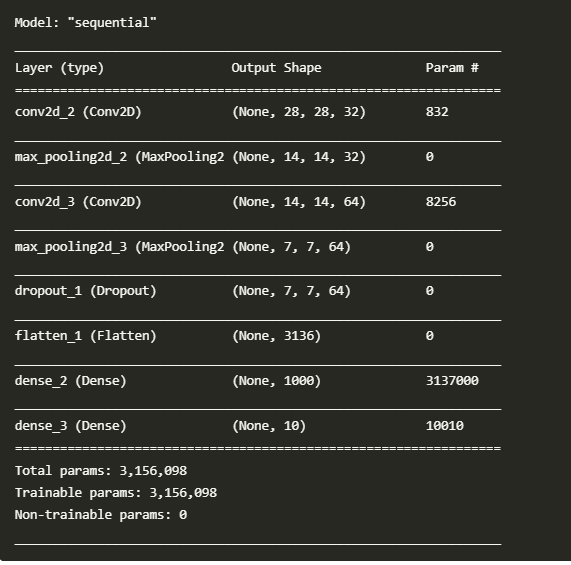
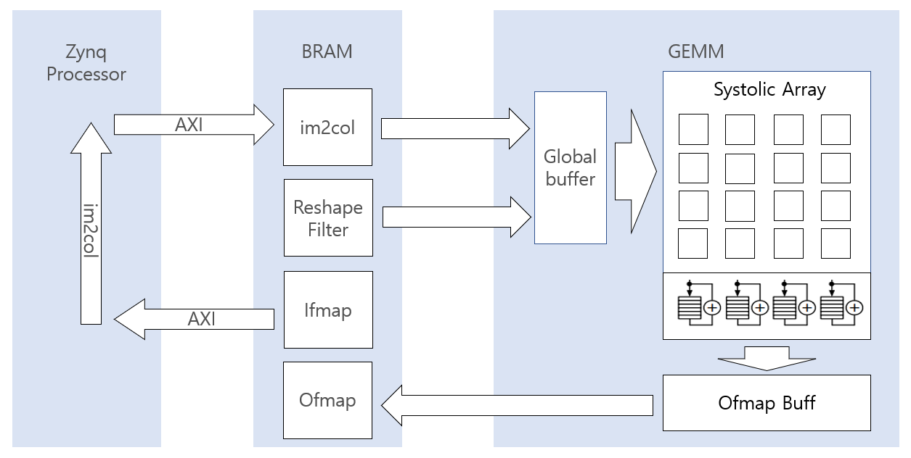
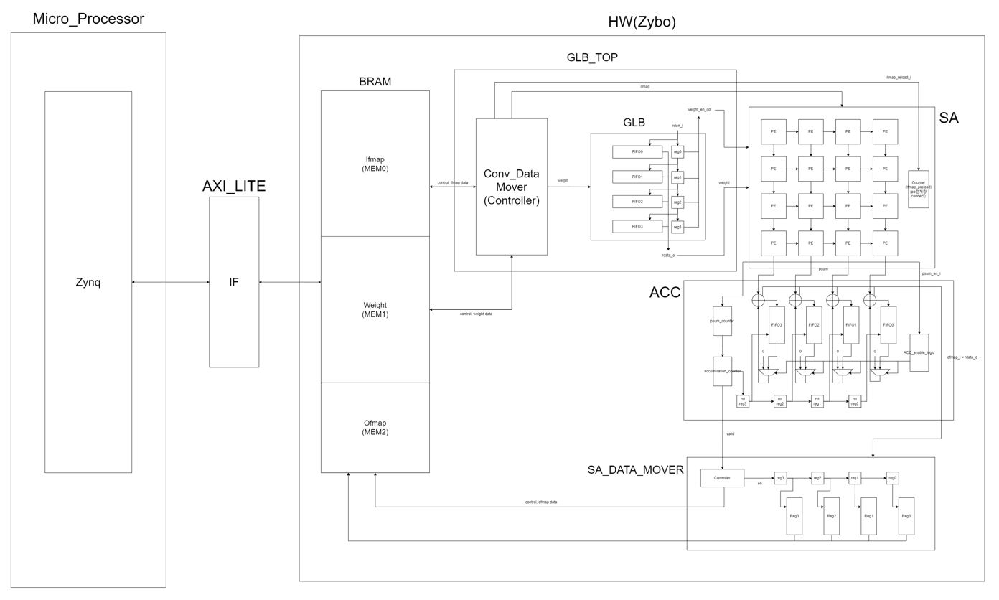
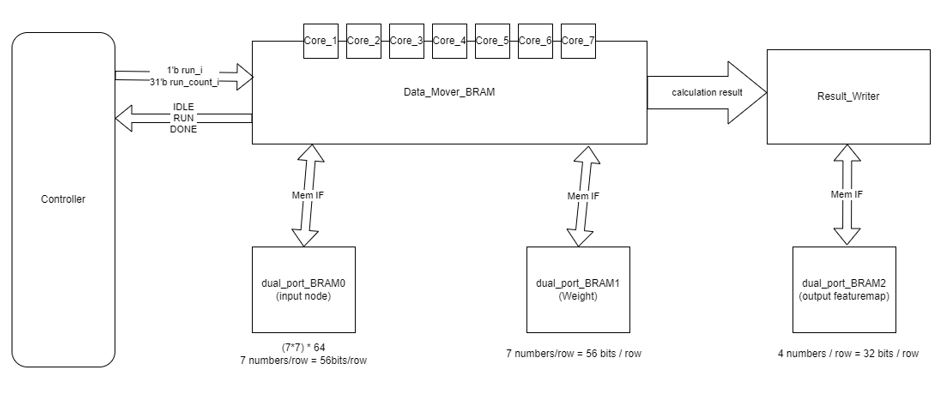

# CNN_HW_PROJ

## Abstract
해당 프로젝트의 목표는 Google TPU[(Tensor Proecssing Unit)](https://cloud.google.com/blog/products/ai-machine-learning/an-in-depth-look-at-googles-first-tensor-processing-unit-tpu)와 유사한 구조의 머신러닝을 위한 co-processor 설계에 있다.

[[Google TPU 논문]](https://arxiv.org/abs/1704.04760)

SW stack에서 target DNN모델을 training시킨 후 HDL로 구현한 HW 모듈 위에서 inferencing과정을 진행, performance 요소들을 평가한다.
Inferencing 과정을 위해서 독립적인 Convolution, Fully Connected, Max Pooling layer들을 구현하였다. 
Convolution layer연산은 im2col, ifmap stationary방식을 채택하였고, ifmap과 Weight에 quatization이 적용된다.  
#

## Design Spec

### FPGA Board : Zybo Z7 20
- FPGA part                 : XC7Z020-1CLG400C  
- 1 MSPS On-chip ADC        : Yes 
- Look-up Tables (LUTs)		: 53,200 
- Flip-flops                : 106,400 
- Block RAM		            : 630 KB 
- Clock Management 	        : 4 
- Available Shield I/O		: 40 
- Total Pmod Ports		    : 6 
- Fan Connector		        : Yes 
- Zynq Heat Sink            : Yes 
- HDMI CEC Support		    : TX and RX ports 
- RGB LEDs		            : 2 

[ZYBO Reference Manual](https://www.xilinx.com/content/dam/xilinx/support/documents/university/XUP%20Boards/XUPZYBO/documentation/ZYBO_RM_B_V6.pdf)  
#

### DNN Model : MNIST Classifier

### Quantization
- data type -> unsigned int8

### MAC Operation
- Using FPGA DSP, 10 < latency < 20(ns) (1clock = 10ns)

### SRAM (FPGA BRAM) 
- Port        : True_dual_port_ram 
- Latency     : R/W = 1clk 
- Size        : 640kB 
- Bandwidth   : 512 bit per cycle  
#

## AXI BUS
- Convolution layer의 Matrix multiplication을 위해선 이전 layer의 output인 tensor를 im2col변환 이후에 matrix형태로 전달될 필요가 있다. 
- SW stack에서 im2col변환을 수행하기 위해서 BRAM 과 Zynq프로세서 사이의 통신에 AMBA protocol의 일종인 AXI bus를 이용하였다.

## Architecture

### 1. Convolution layer

#### 1-1) Conv Data Mover
- BRAM에서 conv연산을 위한 ifmap과 weight를 주소값을 통해 호출하고, ifmap은 SA(Systolic Array)로 preload시키고, weight는 GLB로 전달한다. 

#### 1-2) Global Buffer(GLB)
- Conv Data Mover로부터 받아온 weight값들을 ifmap stationary연산을 위한 형태로 SA에 전달하기 위해서 buffering시킨다. 

#### 1-3) Systoilc Array(SA)
- 다수의 PE(Processing Element)가 서로 연결되어 ifmap, weight, partial sum을 전달한다. 
- Weight, Partial sum 값들은 PE에서 다른 PE로 forwarding될 때 valid신호도 동시에 전달된다. 
- PE연산과 primitive들의 data&valid(en) 신호들의 forwarding을 통해서 정방행렬 matrix 2개의 multiplication이 수행된다. 

#### 1-4) Accumulator
- FIFO와 adder의 조합으로 SA에서 전달받은 psum값을 psum_valid신호를 이용해서 fifo에 write한다.
- FIFO의 rdata를 feedback으로 사용, add 이후에 다시 FIFO에 write하는 방식으로 accumulation을 수행한다.  

#### 1-5) SA Data Mover
- Accumulator로부터 전달받은 ofmap 값들을 buffer에 저장하고 BRAM에 write하는 동작을 수행한다.  
#

### 2. FC layer

#### 2-1) FC CORE
- Multipilcation core다수와 accmulation을 위한 buffer로 구성한다.
#### 2-2) FC DATA MOVER
- Ifmap, weight값들을 BRAM의 주소로부터 read하고, 결과값인 ofmap을 다시 BRAM에 write하는 Data Mover로 구성되었다.  
#

### 3. Pooling layer
- Max Pooling과 같은 경우에도 pooling연산을 위한 Core와 Data Mover로 구성되었다. (추가 작성필요)  
#

## Simulation

#### 1. Testbench Simulation
- Path: /SIM/(module별 tb)
- Vivado 2021.2 simulator
- Vitis 2021.2

#### 2. Golden Reference
- Path: /SW/golden_ref.c
- 사용법
    1) golden_ref.c의 rand로 생성 되는 ifmap, weight txt파일 path 재설정
    2) Verilog tb_GEMM의 txt파일 open path 재설정
    3) Vivado simulation 실행 및 c로 생성된 ofmap 폴더와 verilog testbench로 생성된 ofmap 값 변경    
#

## ETC
- Conv연산을 위한 MMU와 FC연산을 위한 연산 core의 scale은 해당 project의 target DNN model에 적합한 크기로 구현하였다. 
- verilog코드 내부의 parameter 값들을 변경하여 module의 크기를 변경하여 latency와 resource를 조절할 수 있다.  
#

## Version
1. 2022/07/18 : 1st